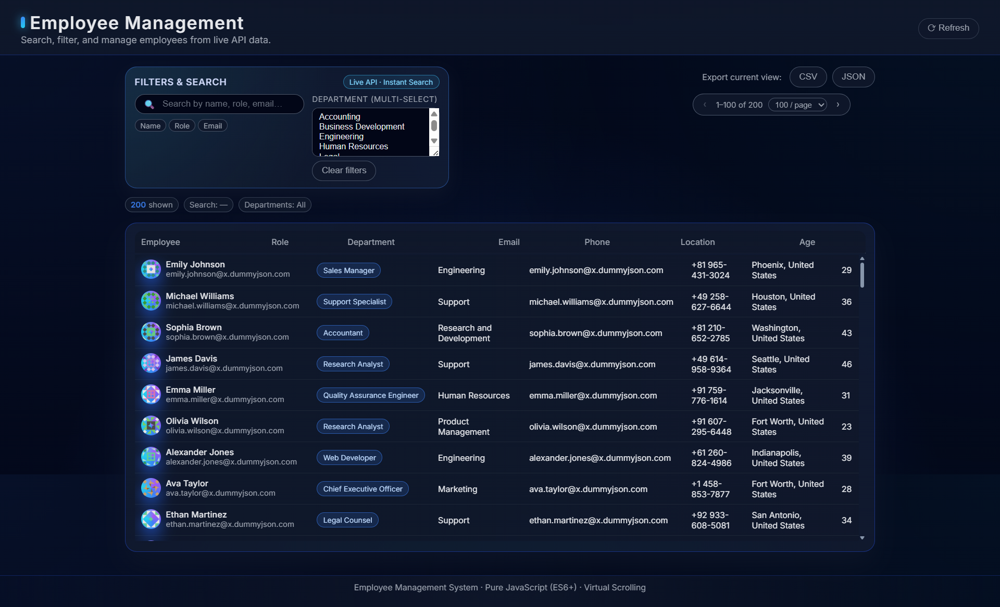

# Employee Management System

*A modular JavaScript application for managing and browsing employee records, built without any frontend frameworks.*

<p align="center">
  
</p>

---

## Overview

This project is a lightweight Employee Management System created using **pure JavaScript (ES6+), HTML, and CSS**, following a clean, modular structure.
It demonstrates how a well-organized frontend can be built without React, Vue, or any third-party libraries.

The application retrieves employee data from a public API and displays it through a modern dashboard interface. It includes searching, filtering, pagination, CSV/JSON export, virtual scrolling for performance, and a graceful fallback to local data when the remote API is unavailable.

---

## Key Features

### **• Live API data**

The app loads employee information from a public open-data API.

If the remote API is temporarily unavailable, the system automatically falls back to a small local JSON dataset included in the project.

---

### **• Search and Filtering**

* Search by name, email, role, and department
* Multi-select department filter
* Clear-all option

---

### **• Virtualized Table**

The table uses virtual scrolling, which renders only visible rows.
This keeps the interface smooth and responsive even with large datasets.

---

### **• Pagination**

* Configurable page size
* Next/previous navigation
* Fully synced with search and filtering

---

### **• Data Export**

Export the current view (including filters) as:

* **CSV**
* **JSON**

---

### **• Clean, modern UI**

* Dark dashboard-style interface
* Sticky table headers
* Role badges, avatars, and subtle animations
* Fully responsive layout

---

## Project Structure

```
employee-management-system/
├── index.html
├── README.md
├── favicon.ico
├── assets/
│   └── screenshot.png
├── api-data/
│   └── employees.json
├── css/
│   └── styles.css
└── js/
    ├── app.js
    ├── api/
    │   └── EmployeeAPI.js
    ├── components/
    │   ├── SearchComponent.js
    │   ├── TableComponent.js
    │   └── PaginationComponent.js
    ├── models/
    │   ├── Employee.js
    │   └── EmployeeCollection.js
    ├── services/
    │   └── DataService.js
    └── utils/
        └── helpers.js
```

Each folder contains one responsibility:

### **`api/`**

Handles external and fallback data fetching.

### **`models/`**

Defines the Employee class and collection logic (filtering, normalizing data).

### **`services/`**

Coordinates between the API and the UI components.

### **`components/`**

Self-contained UI components:

* Search panel
* Pagination controls
* Virtual scrolling table

### **`utils/`**

Small reusable helper functions (debounce, CSV export, DOM helpers).

---

## How to Run the Project Locally

Because the application uses ES modules and the Fetch API, it must be served over **a local web server**.
Opening `index.html` directly will not work.

Choose any of the following methods:

---

### **Option 1 — VSCode Live Server (Recommended)**

1. Open the project folder in Visual Studio Code
2. Install the **Live Server** extension (if not already installed)
3. Right-click on `index.html`
4. Click **“Open with Live Server”**
5. The project will open in your browser

---

### **Option 2 — Node.js**

If Node is installed:

```bash
npx serve
```

Then open the local URL printed in your terminal.

---

### **Option 3 — Python**

If Python 3 is installed:

```bash
python -m http.server
```

Then open:

```
http://localhost:8000
```

---

## Using the Application

Once the project runs:

### **1. Browse the employee list**

Employees are loaded automatically from the API or fallback data.

### **2. Search**

Use the search bar to filter by:

* Name
* Email
* Role
* Department

(Searching is live and debounced for smooth typing.)

### **3. Filter by department**

Use the multi-select field on the right.

### **4. Pagination**

Select page size or move between pages.

### **5. Export**

Use the buttons in the top-right:

* Export filtered results as **CSV**
* Export filtered results as **JSON**

---

## Notes

* The project does not use any frameworks or external libraries.
* It is designed to be easy to extend with new features.
* The codebase follows clean separation of concerns and is structured for clarity.